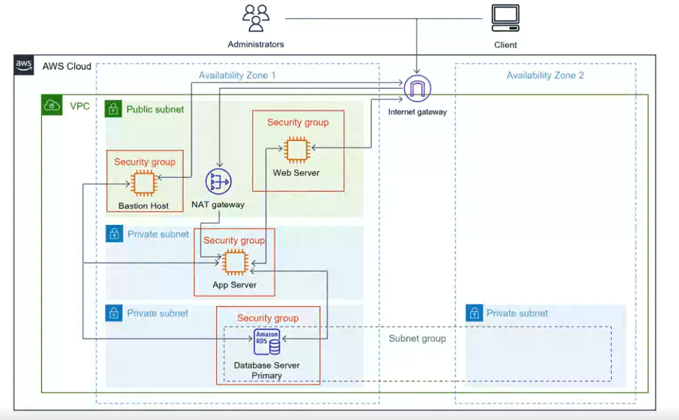

#  AWS 3-Tier Architecture Project

## Live Concept
This project simulates a real-world production architecture used in modern cloud environments.

## Overview
This project demonstrates my ability to design and deploy a secure and scalable cloud architecture using AWS.

The application is structured using a **3-tier architecture**:
- Presentation Layer (Web Server)
- Application Layer (App Server)
- Database Layer (RDS)

## Architecture Design

User → Internet Gateway → Web Server (Public Subnet)  
→ App Server (Private Subnet)  
→ Database (RDS - Private Subnet)

## AWS Services Used

- Amazon VPC
- Public & Private Subnets
- Internet Gateway
- NAT Gateway
- EC2 (Bastion Host, Web Server, App Server)
- Amazon RDS (MariaDB)
- Security Groups

## Security Implementation

- Bastion Host used for secure SSH access
- Private subnets for application and database layers
- Security Groups restricting access between layers
- No public access to the database

## Deployment Steps

1. Create VPC and Subnets
2. Configure Route Tables
3. Setup Internet Gateway & NAT Gateway
4. Configure Security Groups
5. Launch EC2 Instances
6. Install Web Server (Apache)
7. Install App Server (MariaDB)
8. Create RDS Database
9. Test connectivity between layers

## Testing

- SSH access via Bastion Host
- Communication between EC2 instances
- Database connection from App Server

##  Project Structure

aws-3tier-architecture-project/
│── README.md
│── architecture.png
│── scripts/
│ ├── web-setup.sh
│ └── app-setup.sh
│── docs/
│ └── steps.md

## Why this project matters

3-tier architectures are widely used in real-world applications to ensure:
- Scalability
- Security
- Separation of concerns

This project reflects a real production-like environment in AWS.

## Key Learnings

- Designing secure cloud architectures
- Network isolation using VPC
- Managing communication between layers
- Deploying real-world infrastructure on AWS

## Author

**Aboubacar Camara**  
Aspiring Cloud & Full-Stack Developer
